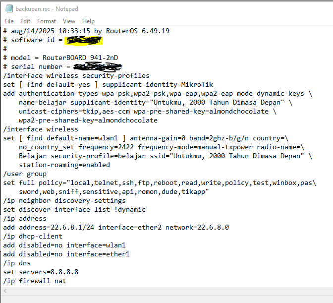

# LAB-12-Export-dan-Import-pada-Mikrotik
Kamis 14 Agustus 2025

# Export dan Import pada Mikrotik
  Secara Default, berintah Export hanya akan menampilkan kumpulan perintah konfigurasi pada terminal. Tapi, kumpulan perintah yang ditampilkan oleh fitur export bisa juga disimpan dalam bentuk file dengan menambah parameter "file". PAda versi RouterOS 5.12 keatas, ada tambahan fungsi menarik di fitur export/import. Yakni fungsi **Compact**. Dengan fungsi ini, maka hanya konfigurasi yang ditambahkan secara manual yang akan ditampilkan atau disimpan. Maka perintah export import bisa dita tulis begini.

    export compact file="backupan"
    import file-name="backupan"

Hasil Perintah Export berupa file dengan ekstensi ***.rsc**. Kita bisa download, kemudian membuka dan mengedit file tersebut dengan text editor. Berbeda dengan file backup yang berupakan file binary yang tidak bisa dibaca jika dibuka dengan aplikasi text editor. Hasil filenya jika dibuka di notepad akan seperti ini.  
  
  

Perlu diketahui, perintah export tidak menyimpan konfigurasi user dan password internal MikrotikOS. Export bisa digunakan untuk menampilkan konfigurasi salah satu fitur tertentu, tanpa harus menampilkan semua konfigurasi router. 

Export Import Kriteria:  
- Tidak bisa dengan menu click (GUI)  
- Tidak backup all config  
- Harus reboot kalo mau restore
- Hanya ackup sebagian konfig
- Bisa dibaca lewat text editor

# Kesimpulan
Export dan Import sebenarnya hampir mirip dengan Backup Restore, namun tentu saja ada perbedaannya. File Export Import berekstensi ***.rsc** yang bisa di edit/buka dengan teks editor. Bisa digunakan untuk menampilkan konfigurasi salah satu fitur tertentu, tanpa harus menampilkan semua konfigurasi router. 
